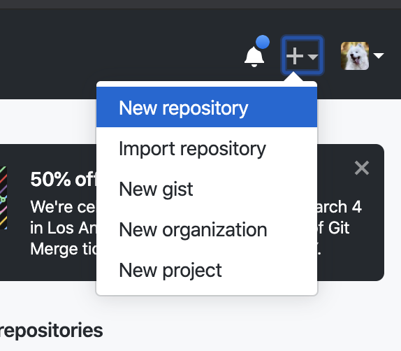
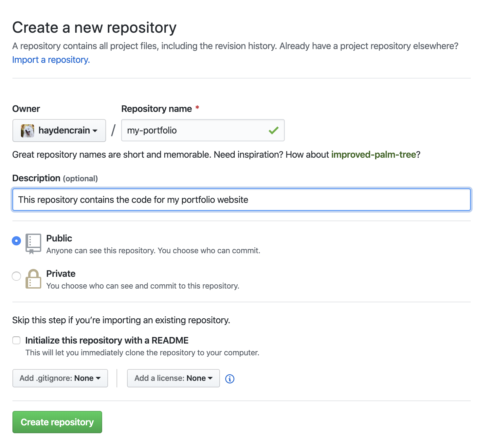

# Porfolio Website Creation Guide

## Step X - Create a Github Account
1. Go to https://github.com/join
2. Sign up using the form provided on the home page

## Step X - Create a Github Repository

## Step X - Download and Install Git

TODO: flesh out this https://www.atlassian.com/git/tutorials/install-git

### Mac
https://git-scm.com/downloads

### Windows
https://gitforwindows.org/

## Step X - Clone your repository

## Step X - Download and install Hugo
https://gohugo.io/getting-started/quick-start/

## Step X - Download a Hugo Blog Theme
[Clean White Blog Theme](https://themes.gohugo.io/hugo-theme-cleanwhite/)

## Step X - Customise your Page

## Step X - Apply your changes to your repository

## Step X - Create a Netlify Account

## Step X - Link your Repository to Netlify

## (Optional) Step X - Buy a .me domain!